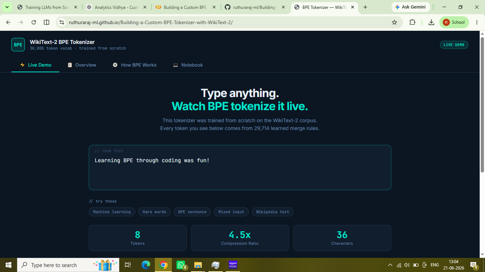
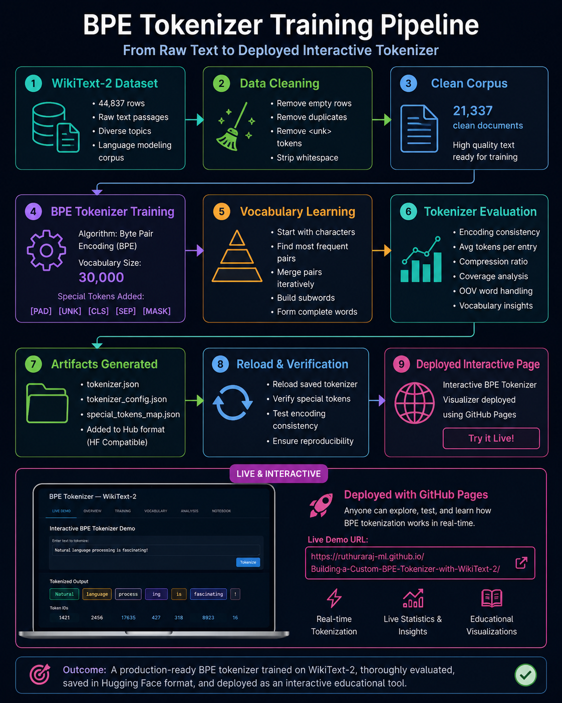
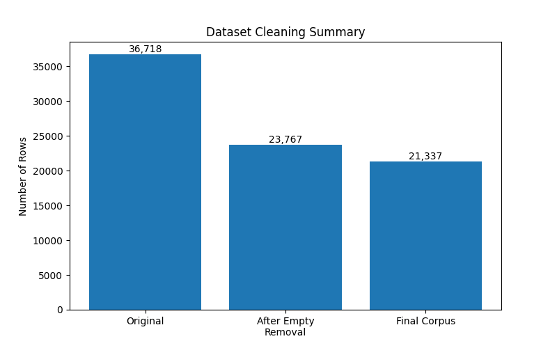
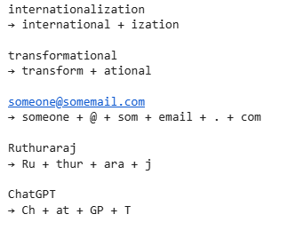

# 🧩 Building a Custom BPE Tokenizer with WikiText-2

<p align="center">
  
  
  
  
  
</p>

---

## 📖 Project Overview

Modern Large Language Models (LLMs) do not process raw text directly. Instead, text must first be converted into tokens using a tokenizer.

This project builds a **Byte Pair Encoding (BPE) Tokenizer** from scratch using the **WikiText-2** dataset and explores how modern NLP systems learn reusable subword units that efficiently represent language.

The project covers:

* Dataset exploration and preprocessing
* Corpus cleaning and deduplication
* BPE tokenizer training
* Vocabulary analysis
* Rare and unseen word handling
* Compression efficiency evaluation
* Tokenizer serialization and reuse
* Interactive web-based tokenizer visualization

---

## 🚀 Live Demo

Explore the interactive tokenizer:

🔗 **Live Demo:**
https://ruthuraraj-ml.github.io/Building-a-Custom-BPE-Tokenizer-with-WikiText-2/

<p align="center">
  
</p>

*Figure 1. Interactive Demo.*

The deployed application allows users to:

* Enter custom text
* Visualize tokenization
* Explore learned vocabulary
* Understand BPE concepts interactively

---

## 🏗️ Architecture Overview

<p align="center">
  
</p>

*Figure 2. Overall project summary.*

The project follows the pipeline below:

WikiText-2 Dataset
↓
Data Cleaning & Deduplication
↓
Clean Corpus (21,337 Documents)
↓
BPE Tokenizer Training
↓
Vocabulary Learning (Characters → Subwords → Words)
↓
Tokenizer Evaluation
↓
Save & Reload Tokenizer
↓
Interactive GitHub Pages Deployment

---

## 📊 Dataset Statistics

| Metric                   |  Value |
| ------------------------ | -----: |
| Original Training Rows   | 36,718 |
| Empty Rows Removed       | 12,951 |
| Duplicate Rows Removed   |  2,430 |
| Final Training Documents | 21,337 |
| Unique Words             | 33,276 |

<p align="center">
  
</p>

*Figure 3. Data Cleaning summary.*
---

## ⚙️ Training Configuration

| Parameter          | Value                            |
| ------------------ | -------------------------------- |
| Algorithm          | Byte Pair Encoding (BPE)         |
| Vocabulary Size    | 30,000                           |
| Dataset            | WikiText-2                       |
| Training Documents | 21,337                           |
| Pre-tokenizer      | Whitespace                       |
| Special Tokens     | `[PAD] [UNK] [CLS] [SEP] [MASK]` |

---

## 📈 Evaluation Results

| Metric                     |         Value |
| -------------------------- | ------------: |
| Vocabulary Size            |        30,000 |
| Average Tokens per Entry   |         84.96 |
| Compression Ratio          |          4.97 |
| Tokenization Consistency   | Deterministic |
| Save & Reload Verification |    Successful |

### Key Observation

The tokenizer achieves an average compression ratio of approximately **5:1**, meaning each token represents nearly five characters of information on average.

---

## 🔍 Vocabulary Analysis

The learned vocabulary exhibits a hierarchical structure:

### Early Vocabulary

```text
th
in
er
ed
the
```

Common character pairs and English subwords.

### Mid Vocabulary

```text
state
million
area
design
```

Frequently occurring words.

### Advanced Vocabulary

```text
potassium
sarcophagus
ecclesiastical
Ferguson
```

Domain-specific terminology and proper nouns.

---

## 🧠 Rare Word Decomposition

One of the most powerful features of BPE is its ability to represent unseen words through reusable subword units.

| Word                                                | Tokenization                        |
| --------------------------------------------------- | ----------------------------------- |
| internationalization                                | international + ization             |
| transformational                                    | transform + ational                 |
| electromechanical                                   | elect + rome + chan + ical          |
| ChatGPT                                             | Ch + at + GP + T                    |
| Ruthuraraj                                          | Ru + thur + ara + j                 |
| someone@somemail.com                                | someone + @ + som + email + . + com |

These examples demonstrate how BPE generalizes beyond the original training corpus.

<p align="center">
  
</p>

*Figure 4. Rare Word Decomposition.*

---

## 📂 Repository Structure

```text
Building-a-Custom-BPE-Tokenizer-with-WikiText-2/
│
├── notebook.ipynb
├── tokenizer_artifacts/
│   ├── wikitext2_bpe_tokenizer.json
│
├── images/
│   ├── bpe_pipeline.png
│   ├── tokenizer_demo.png
│
├── index.html
├── README.md
├── requirements.txt
└── LICENSE
```

---

## 🛠️ Tech Stack

* Python
* Hugging Face Datasets
* Hugging Face Tokenizers
* Pandas
* NumPy
* Matplotlib
* GitHub Pages

---

## 🎯 Key Learnings

The most important insight from this project was understanding how a relatively compact vocabulary can represent previously unseen words through reusable subword units.

Rather than memorizing every possible word, BPE learns meaningful linguistic building blocks that enable strong vocabulary coverage while maintaining computational efficiency.

This principle forms the foundation of modern language models such as GPT, BERT, Gemma, and LLaMA.

---

## 📚 References

1. WikiText-2 Dataset
2. Hugging Face Tokenizers Documentation
3. Hugging Face Datasets Documentation
4. Sennrich, Haddow & Birch (2016) – Neural Machine Translation of Rare Words with Subword Units

---

## 👨‍💻 Author

**R. Ruthuraraj**

Assistant Professor | AI Trainer | Generative AI Enthusiast

GitHub: https://github.com/ruthuraraj-ml

If you found this project useful, consider giving the repository a ⭐.
